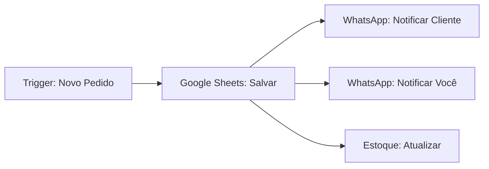

# Introdução ao n8n 🚀

## O que é n8n?

**n8n** (n-eight-n) é uma ferramenta de automação de código aberto que permite conectar diferentes aplicativos e serviços sem precisar escrever código complexo. É como ter um assistente digital que executa tarefas repetitivas automaticamente.

## Por que usar n8n para seu negócio de pudins?

### ✅ Vantagens

1. **Economia de Tempo**: Automatiza tarefas repetitivas como registrar pedidos, atualizar planilhas e enviar mensagens
2. **Redução de Erros**: Menos chances de esquecer um pedido ou ingrediente
3. **Disponibilidade 24/7**: Suas automações trabalham enquanto você dorme
4. **Escalabilidade**: Cresce junto com seu negócio
5. **Custo-benefício**: Versão gratuita robusta disponível
6. **Sem código**: Interface visual fácil de usar

### 💰 Custo

- **n8n Cloud**: Plano gratuito com 5.000 execuções/mês (suficiente para começar)
- **Self-hosted**: Gratuito e ilimitado (requer servidor próprio)

## Conceitos Básicos

### Workflow (Fluxo de Trabalho)

Um workflow é uma sequência de ações automatizadas. Exemplo para receber pedidos:

```
Formulário Online → Google Sheets → WhatsApp → Email
```

### Nodes (Nós)

Cada etapa do workflow é um "node". Tipos principais:

1. **Trigger Nodes** (Gatilhos): Iniciam o workflow
   - Exemplo: "Novo formulário enviado"
   
2. **Action Nodes** (Ações): Executam tarefas
   - Exemplo: "Adicionar linha no Google Sheets"
   
3. **Logic Nodes** (Lógica): Tomam decisões
   - Exemplo: "Se estoque < 5, enviar alerta"

### Credentials (Credenciais)

São as permissões para n8n acessar seus serviços (Google, WhatsApp, etc.). Você configura uma vez e reutiliza.

## Como Funciona na Prática?

### Exemplo Real: Receber um Pedido de Pudim

**Sem Automação** ❌:
1. Cliente preenche formulário
2. Você recebe email
3. Você abre email
4. Você copia dados para planilha manualmente
5. Você envia WhatsApp para cliente
6. Você anota no caderno

**Com n8n** ✅:
1. Cliente preenche formulário
2. **n8n faz todo o resto automaticamente!**
   - Salva na planilha
   - Envia WhatsApp para você e cliente
   - Atualiza estoque
   - Registra no sistema

## Estrutura de um Workflow Básico



## Casos de Uso para Negócio de Pudins

### 1. Vendas 💰
- Receber e processar pedidos automaticamente
- Enviar confirmações e atualizações de status
- Integrar pagamentos

### 2. Estoque 📦
- Descontar ingredientes após cada venda
- Alertar quando estoque baixo
- Gerar relatórios de consumo

### 3. Preços 🏪
- Monitorar promoções em supermercados
- Comparar preços entre lojas
- Receber alertas de ofertas

### 4. Marketing 📱
- Enviar pesquisas de satisfação
- Publicar em redes sociais
- Enviar promoções para clientes

## Comparação com Outras Ferramentas

| Ferramenta | Custo | Complexidade | Flexibilidade |
|------------|-------|--------------|---------------|
| **n8n** | Grátis/Baixo | Média | Alta |
| Zapier | Alto | Baixa | Média |
| Make (Integromat) | Médio | Média | Alta |
| IFTTT | Baixo | Baixa | Baixa |
| Código Manual | Grátis | Alta | Máxima |

### Por que escolher n8n?

- ✅ Código aberto
- ✅ Sem limites de automações (self-hosted)
- ✅ Interface visual intuitiva
- ✅ Comunidade ativa
- ✅ Muitas integrações disponíveis
- ✅ Possibilidade de usar código quando necessário

## Próximos Passos

Agora que você entende o básico, vamos para a prática:

👉 **[Instalação e Configuração](02-instalacao-configuracao.md)**

## Recursos Adicionais

- 🌐 [Site Oficial n8n](https://n8n.io)
- 📖 [Documentação Oficial](https://docs.n8n.io)
- 💬 [Comunidade n8n (Forum)](https://community.n8n.io)
- 🎥 [Canal YouTube n8n](https://www.youtube.com/@n8n-io)
- 📺 [Tutoriais em Português](https://www.youtube.com/results?search_query=n8n+tutorial+português)

## Dúvidas Frequentes

### Preciso saber programar?

**Não!** n8n foi feito para ser visual e fácil. Mas se souber programar, pode fazer coisas ainda mais avançadas.

### É seguro conectar minhas contas?

**Sim!** n8n usa OAuth e outros métodos seguros. Você controla quais permissões dar.

### Posso testar antes de usar de verdade?

**Sim!** Todos os workflows podem ser testados antes de ativar. Você pode fazer testes com dados falsos.

### E se eu precisar de ajuda?

- Documentação deste projeto
- Comunidade n8n
- Tutoriais no YouTube
- Grupos de WhatsApp/Telegram sobre automação

---

➡️ **Próximo:** [Instalação e Configuração](02-instalacao-configuracao.md)
